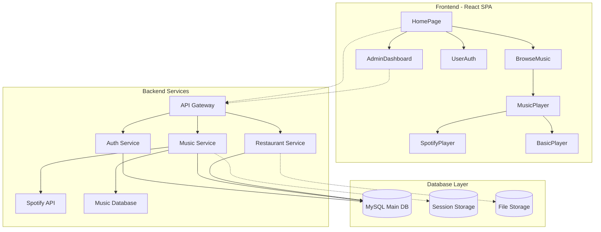
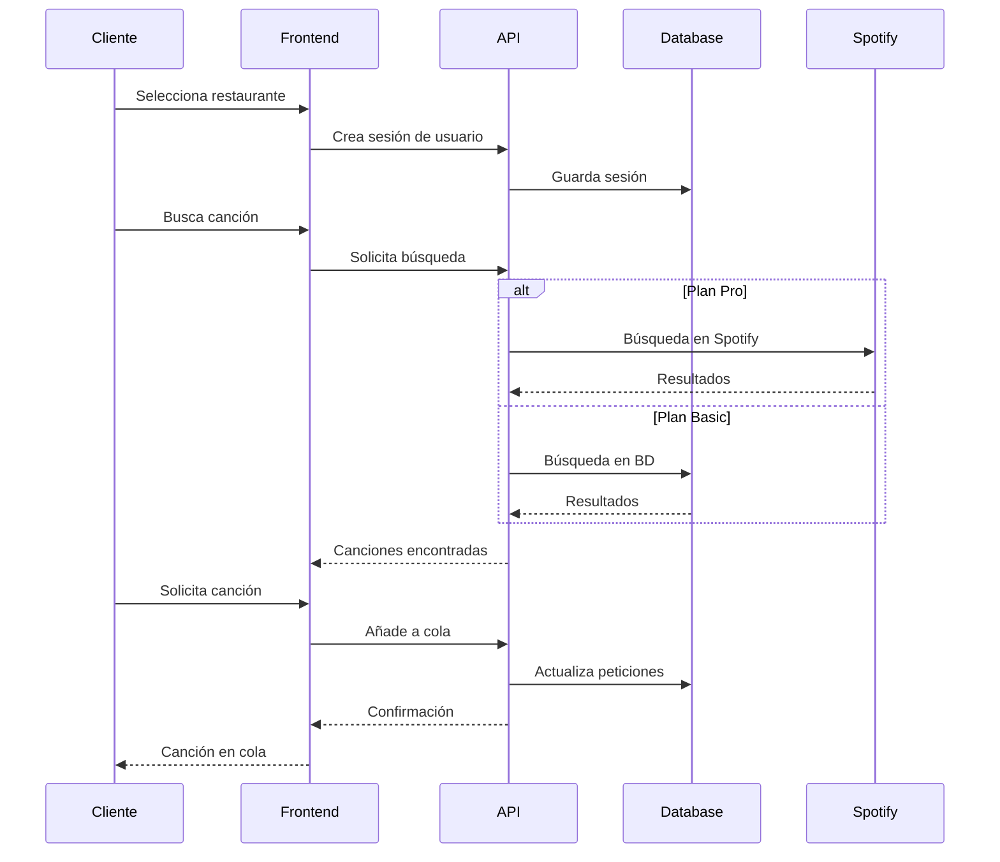

# 🎵 BryJu Sound

<div align="center">

[](https://github.com/tu-usuario/restaurant-music-app)
[](LICENSE)
[](https://nodejs.org/)
[](https://reactjs.org/)

**BryJu Sound - La plataforma líder de música interactiva para restaurantes en Colombia**

[Características](#-características-principales) •
[Instalación](#-instalación-rápida) •
[Documentación](#-documentación) •
[Contribuir](#-contribuir)

</div>

---

## 📋 Descripción

**BryJu Sound** es la plataforma líder de música interactiva para restaurantes en Colombia. Permite a los comensales solicitar canciones en tiempo real, crear experiencias musicales personalizadas y participar activamente en el ambiente de su restaurante favorito. Los administradores mantienen control total sobre la experiencia musical con analytics avanzados y múltiples opciones de integración.

### ✨ Características Principales

#### 🎧 **Para Clientes**
- **Selección Multi-Restaurante**: Acceso a múltiples establecimientos desde una plataforma
- **Peticiones Musicales**: Sistema inteligente de solicitudes con límites configurables
- **Favoritos Persistentes**: Guarda canciones favoritas como invitado o usuario registrado
- **Cola en Tiempo Real**: Visualización del estado actual y próximas canciones
- **Búsqueda Avanzada**: Filtros por género, artista, año y popularidad

#### 👤 **Sistema de Usuarios**
- **Usuarios Invitados**: Acceso inmediato sin registro
- **Usuarios Registrados**: Cuenta permanente con funciones extendidas
- **Playlists Personalizadas**: Creación y gestión de listas de reproducción
- **Historial Musical**: Seguimiento completo de canciones escuchadas
- **Sistema de Reviews**: Calificación detallada de restaurantes

#### 🏢 **Para Administradores**
- **Dashboard Completo**: Panel de control centralizado con métricas en tiempo real
- **Gestión de Cola**: Control total sobre peticiones, orden y reproducción
- **Estadísticas Detalladas**: Analytics de uso, canciones populares y comportamiento
- **Configuración Flexible**: Límites por usuario, géneros permitidos, horarios
- **Super Admin**: Panel de aprobación y gestión de restaurantes

#### 🎵 **Planes de Suscripción**
- **Plan Basic**: Biblioteca musical propia, funciones esenciales
- **Plan Pro**: Integración completa con **Spotify**, catálogo ilimitado
- **Control Dual**: Soporte simultáneo para ambas fuentes musicales

---

## 🏗️ Arquitectura del Sistema



### 🔄 Flujo de Datos Principal



---

## 🚀 Instalación Rápida

### 📋 Prerrequisitos

- **Node.js** >= 18.0.0
- **MySQL** >= 8.0
- **Git**
- Backend compatible (Node.js/Express recomendado)

### ⚡ Instalación del Frontend

```bash
# Clonar el repositorio
git clone https://github.com/tu-usuario/restaurant-music-app.git
cd restaurant-music-app

# Instalar dependencias
npm install

# Configurar variables de entorno
cp .env.example .env
```

### 🔧 Configuración de Variables de Entorno

Crea un archivo [`.env`](.env) en la raíz del proyecto:

```env
# API Configuration
VITE_API_URL=http://localhost:5000/api/v1

# Application Settings
VITE_APP_NAME=Restaurant Music App
VITE_APP_VERSION=1.0.0
VITE_APP_ENV=development

# Debug (opcional)
VITE_DEBUG_MODE=false
```

### 🗄️ Configuración de Base de Datos

Ejecuta el script SQL completo en tu servidor MySQL:

```sql
-- Usar el archivo script2.sql incluido en el proyecto
mysql -u root -p < script2.sql
```

El script [`script2.sql`](script2.sql) incluye:
- ✅ Creación de todas las tablas necesarias
- ✅ Índices optimizados para rendimiento
- ✅ Datos de prueba para desarrollo
- ✅ Procedimientos almacenados
- ✅ Vistas útiles para consultas complejas

### 🏃‍♂️ Ejecutar la Aplicación

```bash
# Desarrollo
npm run dev

# Construir para producción
npm run build

# Previsualizar build de producción
npm run preview
```

La aplicación estará disponible en [`http://localhost:3000`](http://localhost:3000)

---

## 📊 Estructura del Proyecto

```
restaurant-music-app/
├── 📁 public/                 # Archivos estáticos
│   └── vite.svg
├── 📁 src/
│   ├── 📁 components/         # Componentes React organizados por categoría
│   │   ├── 📁 admin/          # Panel administrativo
│   │   │   ├── AdminDashboard.jsx     # Dashboard principal
│   │   │   ├── QueueManager.jsx       # Gestión de cola
│   │   │   └── SuperAdminDashboard.jsx # Panel super admin
│   │   ├── 📁 auth/           # Autenticación y registro
│   │   │   ├── Login.jsx              # Inicio de sesión
│   │   │   ├── Register.jsx           # Registro de usuarios
│   │   │   ├── AdminAuth.jsx          # Auth restaurantes
│   │   │   └── EditProfile.jsx        # Edición de perfil
│   │   ├── 📁 common/         # Componentes reutilizables
│   │   │   ├── Button.jsx             # Botón personalizado
│   │   │   └── Modal.jsx              # Modal genérico
│   │   ├── 📁 layout/         # Componentes de layout
│   │   │   ├── Navbar.jsx             # Barra de navegación
│   │   │   └── Footer.jsx             # Pie de página
│   │   ├── 📁 music/          # Funcionalidades musicales
│   │   │   ├── MusicPlayer.jsx        # Reproductor principal
│   │   │   ├── SongCard.jsx           # Tarjeta de canción
│   │   │   ├── SearchBar.jsx          # Barra de búsqueda
│   │   │   ├── GenreFilter.jsx        # Filtros por género
│   │   │   ├── PlaylistManager.jsx    # Gestión de playlists
│   │   │   ├── RequestQueue.jsx       # Cola de peticiones
│   │   │   ├── SpotifyLogin.jsx       # Integración Spotify
│   │   │   └── UserLimitManager.jsx   # Control de límites
│   │   ├── 📁 pages/          # Páginas principales
│   │   │   ├── HomePage.jsx           # Página de inicio
│   │   │   ├── BrowseMusic.jsx        # Explorador musical
│   │   │   ├── MyRequests.jsx         # Mis peticiones
│   │   │   ├── Favorites.jsx          # Favoritos
│   │   │   ├── ListeningHistory.jsx   # Historial
│   │   │   ├── RestaurantReviews.jsx  # Reviews
│   │   │   └── RestaurantSelector.jsx # Selector restaurante
│   │   └── 📁 restaurant/     # Funciones específicas restaurante
│   │       └── RestaurantDashboard.jsx
│   ├── 📁 hooks/              # Hooks personalizados
│   │   ├── useMusic.js                # Hook principal música
│   │   └── useRestaurantMusic.js      # Hook específico restaurante
│   ├── 📁 services/           # Servicios y APIs
│   │   └── apiService.js              # Servicio API unificado
│   ├── 📁 utils/              # Utilidades y helpers
│   │   └── helpers.js                 # Funciones auxiliares
│   ├── 📄 App.jsx             # Componente raíz
│   ├── 📄 main.jsx            # Punto de entrada
│   └── 📄 index.css           # Estilos globales
├── 📁 Scripts SQL/
│   ├── script.sql             # Script básico (legacy)
│   └── script2.sql            # Script completo actualizado
├── 📋 Configuration Files
│   ├── package.json           # Dependencias y scripts
│   ├── vite.config.js         # Configuración Vite
│   ├── tailwind.config.js     # Configuración Tailwind
│   ├── postcss.config.js      # PostCSS config
│   ├── eslint.config.js       # ESLint rules
│   └── .prettierrc           # Prettier config
└── 📄 README.md              # Documentación
```

---

## 💾 Base de Datos - Schema Detallado

### 🗂️ Tablas Principales

#### 🏪 **Restaurantes**
```sql
restaurants {
  id: VARCHAR(36) PRIMARY KEY
  name: VARCHAR(255) NOT NULL
  slug: VARCHAR(100) UNIQUE
  email: VARCHAR(255) UNIQUE
  rating: DECIMAL(3,2)
  plan_type: ENUM('basic', 'pro')
  spotify_connected: BOOLEAN
  -- + 20 campos adicionales
}
```

#### 👥 **Usuarios**
```sql
-- Usuarios registrados (permanentes)
registered_users {
  id: VARCHAR(36) PRIMARY KEY
  name: VARCHAR(100) NOT NULL
  email: VARCHAR(255) UNIQUE
  role: ENUM('user', 'superadmin')
  -- + campos de preferencias
}

-- Usuarios temporales (sesiones de mesa)
users {
  id: VARCHAR(36) PRIMARY KEY
  registered_user_id: VARCHAR(36) NULL
  restaurant_id: VARCHAR(36) NOT NULL
  table_number: VARCHAR(50) NOT NULL
  user_type: ENUM('guest', 'registered')
  -- + campos de sesión
}
```

#### 🎵 **Sistema Musical**
```sql
songs {
  id: VARCHAR(36) PRIMARY KEY
  restaurant_id: VARCHAR(36) NOT NULL
  title: VARCHAR(300) NOT NULL
  artist: VARCHAR(300) NOT NULL
  genre: VARCHAR(50) NOT NULL
  spotify_id: VARCHAR(50)
  popularity: INT DEFAULT 0
  -- + metadatos adicionales
}

requests {
  id: VARCHAR(36) PRIMARY KEY
  restaurant_id: VARCHAR(36) NOT NULL
  user_id: VARCHAR(36) NOT NULL
  song_id: VARCHAR(36) NOT NULL
  status: ENUM('pending', 'playing', 'completed', 'cancelled')
  queue_position: INT DEFAULT 0
  -- + timestamps
}
```

#### ❤️ **Favoritos y Playlists**
```sql
favorites {
  id: VARCHAR(36) PRIMARY KEY
  user_id: VARCHAR(36) NULL          -- Para invitados
  registered_user_id: VARCHAR(36) NULL -- Para registrados
  song_id: VARCHAR(36) NOT NULL
  favorite_type: ENUM('session', 'permanent')
  -- + metadatos
}

playlists {
  id: VARCHAR(36) PRIMARY KEY
  registered_user_id: VARCHAR(36) NOT NULL
  name: VARCHAR(100) NOT NULL
  is_public: BOOLEAN DEFAULT false
  -- + configuración
}
```

### 🔍 **Vistas Útiles**

El proyecto incluye vistas optimizadas para consultas complejas:

- [`user_favorites_view`](script2.sql#L375): Unifica favoritos de invitados y registrados
- [`user_stats_view`](script2.sql#L399): Estadísticas por tipo de usuario

---

## 🎯 Funcionalidades Principales

### 🔐 **Sistema de Autenticación**

```javascript
// Soporte para múltiples tipos de usuario
const authTypes = {
  guest: 'Acceso inmediato sin registro',
  registered: 'Usuario con cuenta permanente',
  restaurant: 'Administrador de restaurante',
  superadmin: 'Administrador de plataforma'
};

// Ejemplo de uso
const { login, user, isAuthenticated } = useAuth();
await login({ email, password, userType: 'restaurant' });
```

### 🎵 **Reproductor Musical Dual**

El reproductor soporta tanto el plan básico como Pro con Spotify:

```javascript
// Hook principal de música
const {
  songs,
  addRequest,
  currentSong,
  planType,        // 'basic' | 'pro'
  spotifyConnected // boolean
} = useMusic(restaurantSlug);

// Reproductor adaptativo
<MusicPlayer
  planType={planType}
  spotifyConnected={spotifyConnected}
  onPlaySong={playSong}
/>
```

### 📊 **Dashboard Administrativo**

Panel completo con métricas en tiempo real:

```javascript
// Componente AdminDashboard
const dashboard = {
  realTimeQueue: 'Cola de reproducción actual',
  statistics: 'Métricas de uso y popularidad',
  userManagement: 'Control de límites y sesiones',
  contentControl: 'Gestión de biblioteca musical'
};
```

---

## 🛠️ Scripts Disponibles

```json
{
  "scripts": {
    "dev": "vite",                    // Servidor de desarrollo
    "build": "vite build",            // Build de producción
    "preview": "vite preview",        // Preview del build
    "lint": "eslint . --ext js,jsx",  // Linting
    "format": "prettier --write src", // Formateo de código
    "clean": "rm -rf dist node_modules/.vite" // Limpieza
  }
}
```

### 🔧 **Comandos de Desarrollo**

```bash
# Desarrollo con hot reload
npm run dev

# Build optimizado
npm run build

# Análisis del bundle
npm run build -- --analyze

# Linting y formateo
npm run lint
npm run format

# Limpieza completa
npm run clean
```

---

## 🌐 API Endpoints

### 🔑 **Autenticación**
```http
POST /api/v1/auth/login-user          # Login usuario registrado
POST /api/v1/auth/login-restaurant    # Login restaurante
POST /api/v1/auth/register-user       # Registro usuario
POST /api/v1/auth/register-restaurant # Registro restaurante
POST /api/v1/auth/session/:slug       # Crear sesión invitado
GET  /api/v1/auth/profile             # Obtener perfil
PUT  /api/v1/auth/profile             # Actualizar perfil
```

### 🏪 **Restaurantes**
```http
GET  /api/v1/restaurants              # Lista pública de restaurantes
GET  /api/v1/restaurants/:slug        # Detalles por slug
GET  /api/v1/restaurants/:slug/stats  # Estadísticas
```

### 🎵 **Música**
```http
GET  /api/v1/songs/:slug              # Canciones por restaurante
GET  /api/v1/songs/:slug/search       # Búsqueda de canciones
GET  /api/v1/songs/:slug/popular      # Canciones populares
GET  /api/v1/songs/:slug/genres       # Géneros disponibles
```

### 📝 **Peticiones**
```http
POST /api/v1/requests/:slug           # Crear petición
GET  /api/v1/requests/:slug/user      # Mis peticiones
GET  /api/v1/requests/:slug/queue     # Cola del restaurante
PATCH /api/v1/requests/:id/status     # Actualizar estado
DELETE /api/v1/requests/:id           # Cancelar petición
```

### ❤️ **Favoritos y Playlists**
```http
GET  /api/v1/favorites/user/:id       # Obtener favoritos
POST /api/v1/favorites/toggle         # Toggle favorito
GET  /api/v1/playlists/user/:id       # Playlists del usuario
POST /api/v1/playlists/user/:id       # Crear playlist
```

### 🎧 **Integración Spotify (Plan Pro)**
```http
GET  /api/v1/spotify/login            # OAuth login
GET  /api/v1/spotify/callback         # OAuth callback
GET  /api/v1/spotify/search           # Búsqueda Spotify
POST /api/v1/spotify/queue            # Añadir a cola Spotify
POST /api/v1/spotify/play             # Reproducir en Spotify
```

---

## 🎨 Personalización

### 🎨 **Temas y Estilos**

La aplicación utiliza **Tailwind CSS** con tema personalizado:

```javascript
// tailwind.config.js
module.exports = {
  theme: {
    extend: {
      colors: {
        primary: {
          50: '#f0f9ff',
          500: '#3b82f6',
          900: '#1e3a8a'
        }
      },
      fontFamily: {
        sans: ['Inter', 'system-ui']
      }
    }
  }
};
```

### 🎵 **Configuración Musical**

```javascript
// Límites configurables por restaurante
const musicConfig = {
  maxRequestsPerUser: 2,          // Plan Basic
  maxRequestsPerUserPro: 5,       // Plan Pro
  queueLimit: 50,
  allowExplicit: false,
  genresAllowed: ['pop', 'rock', 'jazz']
};
```

---

## 🚀 Despliegue

### 📦 **Build de Producción**

```bash
# Crear build optimizado
npm run build

# Los archivos se generarán en ./dist/
# - index.html
# - assets/
#   ├── index-[hash].js
#   ├── index-[hash].css
#   └── [assets]
```

### 🌐 **Despliegue en Netlify/Vercel**

```bash
# Build command
npm run build

# Output directory
dist

# Redirects para SPA (_redirects file)
/*    /index.html   200
```

### 🐳 **Docker (Opcional)**

```dockerfile
FROM node:18-alpine
WORKDIR /app
COPY package*.json ./
RUN npm ci --only=production
COPY . .
RUN npm run build
EXPOSE 3000
CMD ["npm", "run", "preview"]
```

---

## 🧪 Testing

### 🔧 **Configuración de Tests**

```bash
# Instalar dependencias de testing
npm install -D @testing-library/react @testing-library/jest-dom vitest

# Ejecutar tests
npm run test

# Coverage
npm run test:coverage
```

### 📝 **Ejemplos de Tests**

```javascript
// tests/components/MusicPlayer.test.jsx
import { render, screen } from '@testing-library/react';
import MusicPlayer from '../src/components/music/MusicPlayer';

test('renders music player with song info', () => {
  const mockSong = {
    title: 'Test Song',
    artist: 'Test Artist'
  };
  
  render(<MusicPlayer currentSong={mockSong} />);
  
  expect(screen.getByText('Test Song')).toBeInTheDocument();
  expect(screen.getByText('Test Artist')).toBeInTheDocument();
});
```

---

## 🤝 Contribuir

### 🌟 **¿Cómo Contribuir?**

1. **Fork** el proyecto
2. Crea una rama para tu feature (`git checkout -b feature/nueva-funcionalidad`)
3. Commit tus cambios (`git commit -m 'Añadir nueva funcionalidad'`)
4. Push a la rama (`git push origin feature/nueva-funcionalidad`)
5. Abre un **Pull Request**

### 📋 **Guías de Contribución**

- Sigue las convenciones de código existentes
- Añade tests para nuevas funcionalidades
- Actualiza la documentación cuando sea necesario
- Usa commits descriptivos siguiendo [Conventional Commits](https://conventionalcommits.org/)

### 🐛 **Reportar Bugs**

Usa los [GitHub Issues](https://github.com/tu-usuario/restaurant-music-app/issues) con:
- Descripción detallada del problema
- Pasos para reproducir
- Capturas de pantalla (si aplica)
- Información del entorno (navegador, OS, etc.)

---

## 📄 Licencia

Este proyecto está licenciado bajo la **Licencia MIT** - consulta el archivo [LICENSE](LICENSE) para más detalles.

---

## 👨‍💻 Autor

**Bryan Muñoz** - *BryJu Sound | MasterCode Company*
- GitHub: [@tu-usuario](https://github.com/tu-usuario)
- Email: contacto@mastercode.com

---

## 🙏 Agradecimientos

- **React Team** por el excelente framework
- **Vite** por las herramientas de desarrollo
- **Tailwind CSS** por el sistema de diseño
- **Spotify Web API** por la integración musical
- **Lucide React** por los iconos
- **Community** por feedback y contribuciones

---

## 📈 Roadmap

### 🚀 **Próximas Características**

- [ ] **Modo Offline**: Reproducción sin conexión para plan básico
- [ ] **Integración Apple Music**: Soporte para usuarios de iOS
- [ ] **Chat en Vivo**: Comunicación entre mesas del restaurante
- [ ] **Eventos Especiales**: Sistema de eventos y música temática
- [ ] **API Pública**: Endpoints para integraciones de terceros
- [ ] **Mobile App**: Aplicación nativa React Native
- [ ] **Análisis Avanzado**: ML para recomendaciones personalizadas
- [ ] **Multi-idioma**: Soporte para múltiples idiomas

### 🔄 **Mejoras Planificadas**

- [ ] **Performance**: Optimización de lazy loading
- [ ] **PWA**: Funcionalidades de Progressive Web App
- [ ] **Tests**: Cobertura completa de testing
- [ ] **Documentación**: Documentación técnica completa
- [ ] **CI/CD**: Pipeline de integración continua

---

<div align="center">

**¿Te gusta el proyecto? ¡Dale una ⭐!**

[](https://github.com/tu-usuario/restaurant-music-app/stargazers)

</div>